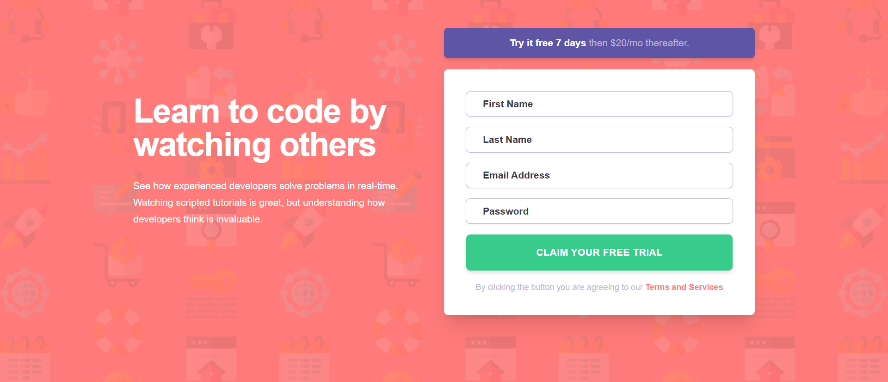

# Frontend Mentor - Intro component with sign up form solution

This is a solution to the [Intro component with sign up form challenge on Frontend Mentor](https://www.frontendmentor.io/challenges/intro-component-with-signup-form-5cf91bd49edda32581d28fd1). Frontend Mentor challenges help you improve your coding skills by building realistic projects. 

## Table of contents

- [Overview](#overview)
  - [The challenge](#the-challenge)
  - [Screenshot](#screenshot)
  - [Links](#links)
- [My process](#my-process)
  - [Built with](#built-with)
  - [What I learned](#what-i-learned)
  - [Continued development](#continued-development)
- [Author](#author)

## Overview

### The challenge

Users should be able to:

- View the optimal layout for the site depending on their device's screen size
- See hover states for all interactive elements on the page
- Receive an error message when the `form` is submitted if:
  - Any `input` field is empty. The message for this error should say *"[Field Name] cannot be empty"*
  - The email address is not formatted correctly (i.e. a correct email address should have this structure: `name@host.tld`). The message for this error should say *"Looks like this is not an email"*

### Screenshot



### Links

- Solution URL: [solution URL](https://your-solution-url.com)
- Live Site URL: [live site URL](https://your-live-site-url.com)

## My process

### Built with

- Semantic HTML5 markup
- CSS custom properties
- Flexbox
- CSS Grid
- Mobile-first workflow
- [React](https://reactjs.org/) - JS library

### What I learned

```jsx
import { memo } from "react";
import { RiErrorWarningFill } from "react-icons/ri";

const Input = ({
  id,
  name,
  type,
  value,
  onChange,
  placeholder,
  error,
  label,
}) => {
  return (
    <div>
      <label htmlFor={id} className="sr-only">
        {label}
      </label>
      <div className="relative">
        <input
          id={id}
          name={name}
          type={type}
          value={value}
          onChange={onChange}
          placeholder={placeholder}
          className={`w-full rounded-md shadow px-6 py-[1ch] outline-[0.2px] text-sm font-600 text-DarkBlue placeholder-DarkBlue placeholder-opacity-60 
            ${
              error
                ? "outline-Red outline-[1.5px] pr-12"
                : "outline-GrayishBlue"
            } 
            focus:outline-none focus:ring-1 transition-colors duration-200`}
          aria-invalid={!!error}
          aria-describedby={error ? `${id}-error` : undefined}
        />
        {error && (
          <RiErrorWarningFill className="absolute right-4 top-1/2 -translate-y-1/2 text-Red pointer-events-none" />
        )}
      </div>
      {error && (
        <p
          id={`${id}-error`}
          className="text-Red text-right text-xs font-medium italic mt-1"
        >
          {error}
        </p>
      )}
    </div>
  );
};

export default memo(Input);

```
```js
export const initialState = {
  firstName: "",
  lastName: "",
  email: "",
  password: "",
  errors: {},
};

export const actionTypes = {
  SET_FIRST_NAME: "FIRST_NAME",
  SET_LAST_NAME: "LAST_NAME",
  SET_EMAIL: "EMAIL_ADDRESS",
  SET_PASSWORD: "PASSWORD",
  SUBMIT_FORM: "SUBMIT",
  RESET_FORM: "RESET",
};

const emailRegex = /^[^\s@]+@[^\s@]+\.[^\s@]+$/;

export const reducer = (state, action) => {
  switch (action.type) {
    case actionTypes.SET_FIRST_NAME:
      return {
        ...state,
        firstName: action.payload,
        errors: { ...state.errors, firstName: "" },
      };
    case actionTypes.SET_LAST_NAME:
      return {
        ...state,
        lastName: action.payload,
        errors: { ...state.errors, lastName: "" },
      };
    case actionTypes.SET_EMAIL: {
      let emailError = "";
      if (action.payload && !emailRegex.test(action.payload)) {
        emailError = "Looks like this is not an email";
      }
      return {
        ...state,
        email: action.payload,
        errors: { ...state.errors, email: emailError },
      };
    }
    case actionTypes.SET_PASSWORD:
      return {
        ...state,
        password: action.payload,
        errors: { ...state.errors, password: "" },
      };
    case actionTypes.SUBMIT_FORM: {
      const errors = {};
      if (!state.firstName) errors.firstName = "First Name cannot be empty";
      if (!state.lastName) errors.lastName = "Last Name cannot be empty";
      if (!state.email) {
        errors.email = "Email Address cannot be empty";
      } else if (!emailRegex.test(state.email)) {
        errors.email = "Looks like this is not an email";
      }
      if (!state.password) errors.password = "Password cannot be empty";
      return {
        ...state,
        errors,
      };
    }
    case actionTypes.RESET_FORM:
      return initialState;
    default:
      return state;
  }
};

```

### Continued development
### Future Enhancements
I want to continue focusing on form validation and user experience in future projects. Some specific areas I plan to improve on:

- Implementing more robust form validation techniques
- Creating more accessible form components
- Exploring different visual feedback mechanisms for form errors
- Optimizing form submission with loading states and better error handling
- Learning more about React's performance optimization techniques like memoization and useMemo/useCallback hooks
- I also want to explore more advanced CSS techniques for creating responsive designs and improving the animation transitions between form states.

### Backend Integration
For a more complete application, I would like to extend this project into a full-stack application by:

- Integrating with MongoDB or PostgreSQL database to store user information
- Building a Node.js/Express backend API to handle form submissions
- Implementing user authentication with JWT tokens
- Adding features like email verification and password recovery
Creating a dashboard for users after successful registration
- Implementing data validation on both client and server sides
- Setting up proper error handling for API requests
- Adding analytics to track form completion rates and common errors
This would transform this component into a fully functional registration system that could be used in real-world applications.


### Useful resources

- [CSS-Tricks Guide to Flexbox](https://css-tricks.com/snippets/css/a-guide-to-flexbox/) - This comprehensive guide helped me understand flexbox layout concepts that were crucial for building the responsive form.
- [React Hook Form Documentation](https://react-hook-form.com/) - Though I implemented my own form validation with useReducer, this resource provided valuable insights on form management best practices.
- [MDN Web Docs: Client-side form validation](https://developer.mozilla.org/en-US/docs/Learn/Forms/Form_validation) - This article helped me understand the principles of good form validation and accessibility considerations.
- [Accessibility in Forms](https://webaim.org/techniques/forms/) - This resource was invaluable for ensuring my form implementation followed accessibility best practices.

## Author

- Frontend Mentor - [@abok-cymk](https://www.frontendmentor.io/profile/abok-cymk)
- Twitter - [@abokallan22](https://www.x.com/abokallan22)

